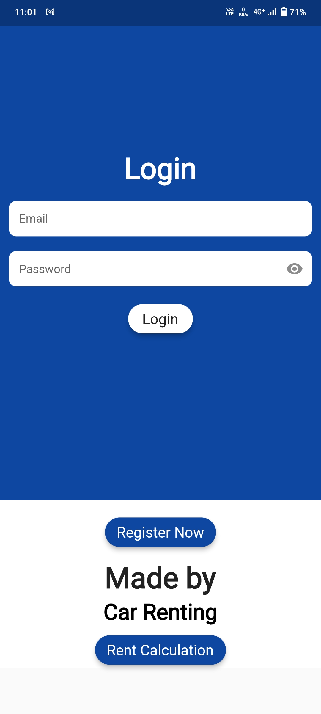
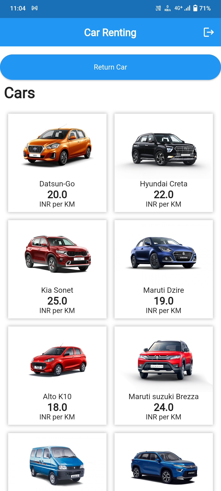
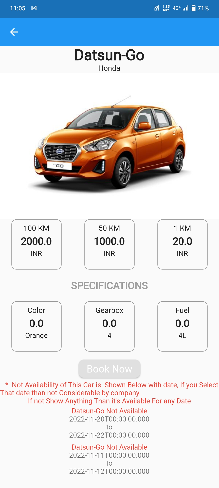
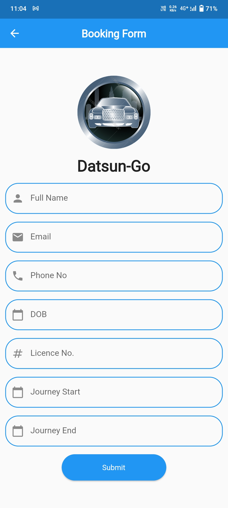
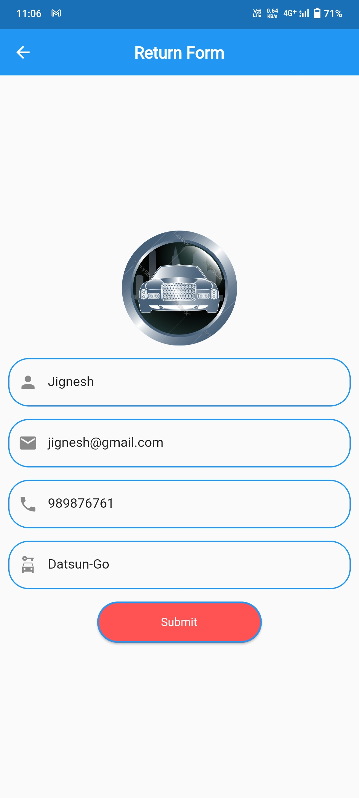

# Car Rental System

It is Car Rental System. Here Customers Takes Car On rent for particular dates. Flutter based Car Rental management system App | Flutter | Backend Firebase

## How to setup on your system :- 

#### Requirements : 
 1. Flutter
 2. Android Studio 
 3. Emulator/Real Device(Android/IOS)

#### How to install : 

1. Check the Official Docs link for installing Flutter : https://flutter.dev/docs/get-started/install 
2. Installing Android Studio & Setup  : https://youtu.be/InigFUSiPl8 
3. or, connect a physical device : https://youtu.be/Gzse_F2AYDs

## Getting Started

Follow these instructions to build and run the project

### Setup Flutter

A detailed guide for multiple platforms setup could be find [here](https://flutter.dev/docs/get-started/install/)

### Setup Project

- Clone this repository using `git clone https://github.com/KashyapTimbadiya/SDP_Project.git`.
- `cd` into the folder.
- `flutter pub get` to get all the dependencies.
- Generate files using Builder Runner (**required**) 
```
flutter packages pub run --no-sound-null-safety build_runner build
```

## Screenshots


<p>






</p>
